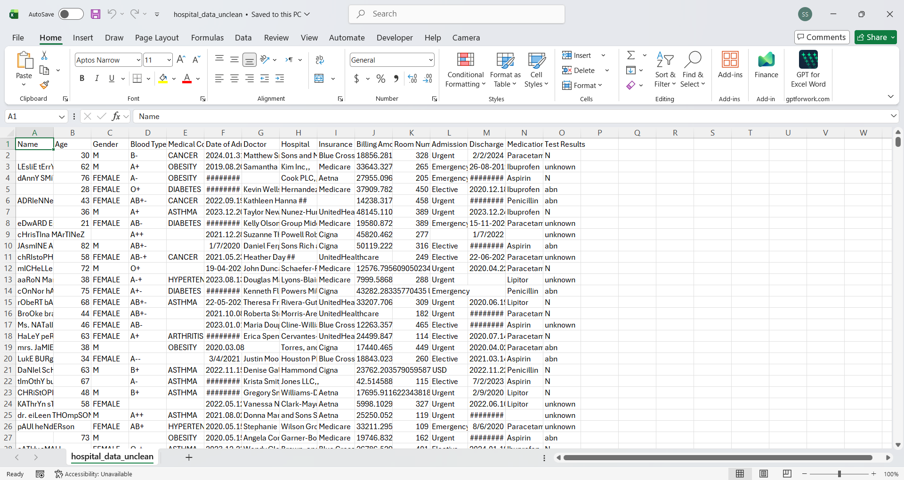
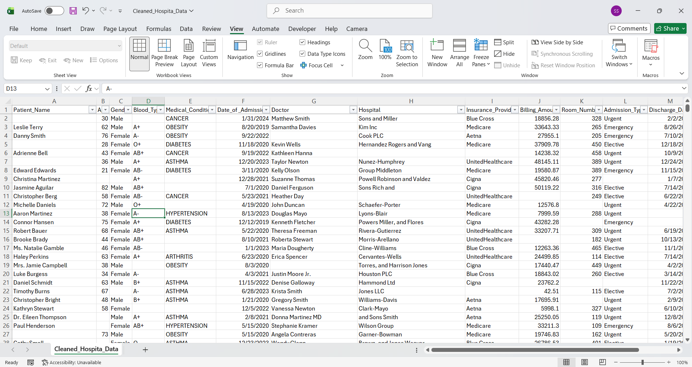

## Project Overview

This project demonstrates the **data cleaning and preprocessing of a healthcare/patient dataset using Microsoft Excel**.

The objective was to identify common data quality issues such as missing values, inconsistent text formatting, inconsistent categorical values, unwanted characters, inconsistent date formats, and improperly formatted numeric values, and then standardise the dataset for further analysis.

## Dataset

The project uses a patient/healthcare dataset containing fields such as:

- Patient Name
- Age
- Gender
- Blood Type
- Medical Condition
- Date of Admission
- Doctor
- Hospital
- Insurance Provider
- Billing Amount
- Room Number
- Admission Type
- Discharge Date
- Medication
- Test Results

## Data Cleaning Process

### 1. Initial Data Preparation

- Converted the dataset into an Excel Table.
- Applied filters using `Ctrl + Shift + L`.
- AutoFit columns using `Alt + O + C + A`.
- Kept completely blank rows as they were because they were not treated as missing values within patient records.
- Selected columns for inspection using `Ctrl + Spacebar`.

### 2. Patient Name

**Issues identified:**
- Blank cells
- Inconsistent capitalization
- Extra spaces

**Cleaning performed:**
- Reviewed blank cells.
- Created a cleaned Patient Name column.
- Used:

```excel
=TRIM(PROPER(A2))
```

`TRIM` removes unnecessary spaces, while `PROPER` standardises capitalization.

### 3. Age

**Issue identified:** Blank cells.

Missing ages were retained for review rather than entering fabricated values.

### 4. Gender

**Issues identified:**
- Abbreviated values such as `M`
- Inconsistent capitalization

**Cleaning performed:**
- Used Find and Replace.
- Selected **Match entire cell contents** to prevent unintended partial replacements.
- Standardised abbreviated and inconsistent gender values.

### 5. Blood Type

**Issue identified:** Inconsistent representations such as:

- `--`
- `+-`
- `++`
- `-+`

These were standardised to consistent representations:

| Original | Standardised |
|---|---|
| `--` | `-` |
| `+-` | `+` |
| `++` | `+` |
| `-+` | `-` |

After standardisation, the cleaned results were copied and converted to static values using **Paste Special → Values**.

### 6. Medical Condition

Blank medical-condition cells were identified and retained for review rather than introducing incorrect values.

### 7. Date of Admission

Dates were standardised into a consistent format so that they could be correctly sorted, filtered, and used for time-based analysis.

### 8. Doctor

**Issues identified:**
- Blank cells
- Unwanted `##` characters after some doctor names

**Cleaning performed:**
- Reviewed blank cells.
- Used Find and Replace to remove `##`.
- Reviewed the resulting doctor names.

### 9. Hospital

**Issues identified:**
- Unwanted special characters
- `,,`
- `,,,`
- `&` appearing before some hospital names

These unwanted characters were removed using Find and Replace, followed by a review of the cleaned hospital names.

### 10. Insurance Provider

Blank cells were identified and retained for review.

### 11. Billing Amount

**Issues identified:**
- Improper numeric representation
- Negative billing amounts
- Inconsistent numeric formatting

**Cleaning performed:**
- Converted the Billing Amount column to Number format.
- Standardised values to two decimal places.
- Applied Conditional Formatting to highlight negative billing amounts.

This helped identify potentially abnormal or invalid billing values.

### 12. Room Number

Blank cells were identified and retained for review.

### 13. Admission Type

Blank cells were identified and retained for review.

### 14. Discharge Date

**Issue identified:** Dates were represented in inconsistent formats.

**Cleaning process:**

1. Created a duplicate of the original Discharge Date column.
2. Standardised date separators using Find and Replace.
3. Used **Text to Columns → Date → YMD** where required.
4. Processed dates represented in month-day-year format using **Text to Columns → Date → MDY**.
5. Applied the final custom format:

```text
mm/dd/yyyy
```

This converted inconsistent date representations into an Excel-recognised format suitable for sorting, filtering, and analysis.

### 15. Medication

Blank cells were identified and retained for review.

### 16. Test Results

The Test Results column was reviewed for inconsistent or abbreviated values.

The following values were standardised:

| Original | Standardised |
|---|---|
| `N` | `Normal` |
| `abn` | `Abnormal` |
| `unknown` | `Unknown` |

## Data Quality Issues Addressed

| Data Quality Issue | Examples of Treatment |
|---|---|
| Missing values | Identified and retained for review |
| Extra spaces | `TRIM()` |
| Inconsistent capitalization | `PROPER()` / standardisation |
| Abbreviated categorical values | Find and Replace |
| Inconsistent blood type representation | Standardised symbols |
| Unwanted characters | Find and Replace |
| Inconsistent dates | Text to Columns + date formatting |
| Improper numeric formatting | Number format + 2 decimals |
| Negative billing values | Conditional Formatting |
| Irregular test-result values | Standardised categories |

## Before and After

### Before Cleaning



### After Cleaning



## Project Files

- `hospital_data_unclean1.csv` — Original uncleaned dataset
- `Cleaned_Hospital_Data.csv` — Cleaned dataset
- `health_data_before_cleaning.png` — Screenshot before cleaning
- `health_data_after_cleaning.png` — Screenshot after cleaning
- `Excel Health Data Cleaning Steps.docx` — Detailed record of the cleaning steps

## Tools Used

- **Microsoft Excel**
  - Filters
  - Excel Tables
  - Find and Replace
  - Conditional Formatting
  - Text to Columns
  - Paste Special
  - Excel formulas
  - Date and number formatting

## Key Learning Outcomes

Through this project, the following practical data-cleaning skills were demonstrated:

- Identifying data quality issues
- Handling missing values without fabricating information
- Standardising categorical data
- Cleaning text fields
- Removing unwanted characters
- Standardising date formats
- Validating numerical data
- Identifying potentially abnormal values
- Preparing healthcare data for analysis
